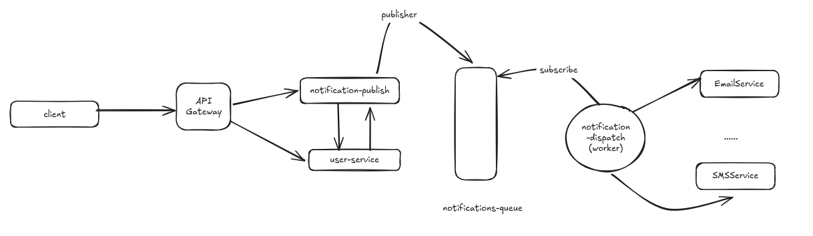

# AsyncNotify
AsyncNotify is a practical asynchronous notification project developed to consolidate knowledge in clean architecture, event-driven architecture, and microservices.

The idea is to simulate a real notification sending flow: a message sent by a client is transformed into an event and processed asynchronously, ensuring decoupling and scalability in the system.

This project was developed with a focus on:

- Applying good architectural practices to the backend

- Using messaging with Redis for inter-service communication

- Building an ecosystem of integrated microservices with Docker and FastAPI

- Simulating real-world notification channels such as email, SMS, and push notifications

# What I learned

- **Clean Architecture**: separação clara de responsabilidades entre as camadas de domínio, aplicação, infraestrutura e interface, garantindo modularização, desacoplamento e boas práticas de código, incluindo princípios **SOLID**.


- **Mensageria com Redis**: uso do Redis como fila de eventos compartilhada entre microserviços.

- **Processamento Assíncrono**: implementação de tarefas assíncronas para processar requisições sem bloquear novas requisições ou tarefas.

- **Comunicação entre Microserviços**: utilização de protocolo HTTP e fila de mensagens para comunicação direta e indireta entre serviços.

- **Event-Driven Architecture**: uso de fila de eventos (notificações) para promover processamento assíncrono entre serviços.

- **APIs com FastAPI**: criação de endpoints claros, performáticos e com documentação integrada.

- **API Gateway**: criacao de api gateway para que clientes nao se connectem diretamente aos micro servicos e por ser redirecionados por ele.

- **Logging**: implementação de logs para registrar e monitorar o comportamento do sistema.

- **Dockerized Microservices**: containerização e orquestração local de serviços com Docker Compose.

--------------------------------------------------

# Arquitecture Overview

A first view of the Async Notifications is showed below:





-----------------------------

# Key Features

- Receive notification requests via HTTP API
- Publish notification events to a Redis queue
- Process notification events asynchronously, without blocking the client
- Forward notifications to specific channels (email, SMS, etc.)
- Query user contact information in a dedicated microservice
- Modular structure that allows you to easily add new notification channels
---------------------------------------

# Technologies

- Python + FastAPI
- Uvicorn
- Redis
- Dockerfile
- Docker Compose

--------------------------------------------------

# Services

The notification system consists of three main microservices:

**notification-publisher**: Receives a client message, converts it to an event, and publishes the event to a message queue.

**notification-dispatch**: Consumes events from the message queue, processes them, and forwards them to specific notification dispatch channels (email, SMS, push, etc.).

**user-service**: Provides user contact information to assist in sending notifications.

----------------------------------------------------------------

## Endpoints

### notification-publisher service

Responsible for receiving notification requests and publishing an event.

POST /notification: receive notication with:

```json

{
  "user_id": "123",
  "message": "Seu agendamento foi confirmado.",
  "channel": "email"  // ou "sms", "push"
}
```
O campo "channel" pode ser "email", "sms" ou "push".
### user-service

Responsible for sending user contact information to assist in sending notifications.

GET /users/{user_id}/contact-info

Returns:

```json
{
    "email": "usertest@gmail.com",
    "sms": "++55 99999999",
    "preferred_channel":"email"
}
```
---------

# Workers

The system has a worker that acts as a listener to consume the message queue.
It processes received events and directs notifications to specific channels, such as email, SMS, etc.


# Design Choices


# How to run locally